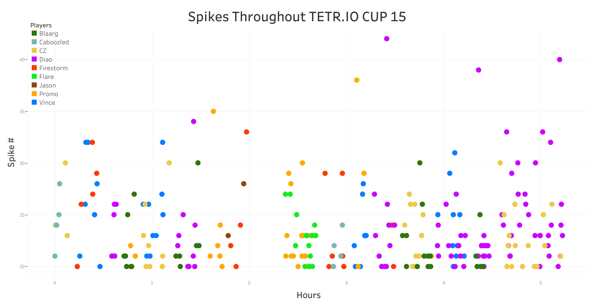
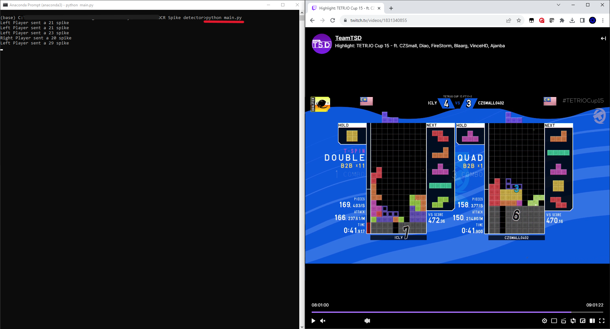

# TETR.IO OCR Spike Detection

## Project Description

This Project is meant to be a spike detector with OCR for 1v1 boards on Tetr.io. I first screen captured a VOD livestream of a Tetr.io tournament which is the video I would be OCRing. Since the OCR process can take anywhere from 0.5-3 seconds, and I wanted to try to capture the spikes in real time, I worked on minimizing the amount of image frames that I wanted to OCR. To do this, I first preprocessed the frames with techniques such as gray scaling, gaussian blurring, thresholding etc. Then I found the contours of this preprocessed frame and filtered them down so it only contained the contours of numbers which is the spike contours I would want to OCR. After these frames were found they were put into a queue where the OCR process is done and only the final value of the spike is used.

## Overview of How Spikes work in TETR.IO

In tetr.io when you send an attack to your opponent, a number is shown on your side of the board, which is the amount of attack you send. If you send multiple attacks in short succession the number displayed is the total attack you sent in that time, which is what I refer as the spike counter. To add to the spike counter, you have to send an additional attack within 1 second of the last attack you had that was within the spike. For example, if you send 4 lines and 0.5 seconds later send 3 lines, the spike is now 7 and the spike timer is reset back to 0. If an additional attack of 5 is sent 0.7 seconds after the 3 lines, then the spike is now 12 and the spike timer is again reset. If no more attacks are sent within 1 second of the 5 attack, then the spike is finished and a new spike counter may start.

## Findings

I wanted to test how well the program would do when extrapolated to a whole tournament so I tried it on TETR.IO CUP 15, a tournament from a few months ago that is considered the most competitive tournament of all time, and as a result I believed it would contain the most spikes out of any tournament. A VOD of the tournament can be found [here](https://www.twitch.tv/videos/1831340855?t=03h16m42s) (The first 3 hours and 15 minutes of the tournament was skipped as they contain multiple matches going on at once and do not work for this program). I only targeted spikes that were 20 or larger(also refered to as full screen spikes since 20 lines is the full board height), as they are considered fairly large and smaller spikes were not detected as well with the program. After the program finished it ended up captured 249 screenshots(viewable in the TC15 Spikes folder) of spikes. While I am unable to see how many spikes were missed without watching 5 and a half hours of footage, for the screenshots that were taken, only 2 did not contain an actual spike, which is an overall 99.1% accuracy rate. Of the 247 screenshots containing a spike, only 13 of them were found to detect the incorrect number for the spike, giving a precision of 94.7% rate. I was overall happy with the results of the program, but I still wanted to look further in on the results and the players that competed, and came up with a table and graph displaying my findings. (**Note:** *These results may not be indicative of any of these players full skill, as these results are for only a single tournament, and it is possible some of the spikes these players achieved during this tournament were missed by my program*)

The graph shows the spikes throughout the stream and you can see that when two players overlap this is when they 1v1 on stream, such as Flare VS Promo at 2 and a half hours and the two sets Diao and CZ played at the end of the tournament.You can see how consistently Diao is able to get 30+ spikes, getting a total of 9 throughtout the tournament, while the most anyone else achieved was Vince with 4. In fact, everyone else got a combined 14 of them, which means of the spikes I tracked, Diao on his own nearly got 40% of the 30 spikes on his own

Player     | Sets Played | Games Played | Total 20+ Spikes | Largest Spike | Spikes Per Set | Spikes Per Game | Spike Average
---------- | ----------- | ------------ | ------------ | ------------- | -------------- | --------------- | -------------
CZ         | $5$         | $86$           | $38$           | $39$            | $7.6$            | $0.442$           | $23.08$
Diao       | $\color{lime}{\textbf{7}}$ | $\color{lime}{\textbf{123}}$ | $\color{lime}{\textbf{81}}$ | $\color{lime}{\textbf{42}}$ | $\color{lime}{\textbf{11.57}}$ | $\color{lime}{\textbf{0.659}}$ | $24.06$
Blaarg     | $4$         | $62$           | $29$           | $30$          | $7.25$           | $0.468$           | $\color{red}{\textbf{22.1}}$
Vince      | $4$         | $64$           | $33$           | $32$          | $8.25$           | $0.516$           | $24.61$
Promo      | $4$           | $52$         | $26$           | $38$          | $6.5$            | $0.5$             | $23.85$
Firestorm  | $4$           | $62$         | $17$           | $33$          | $4.25$           | $0.274$           | $24.53$
Caboozled  | $2$           | $27$         | $8$            | $28$          | $4$              | $0.296$           | $23.13$
Flare      | $2$           | $28$         | $13$           | $\color{red}{\textbf{27}}$ | $6.5$            | $0.464$           | $22.85$
Jason      | $\color{red}{\textbf{1}}$ | $\color{red}{\textbf{13}}$  | $\color{red}{\textbf{2}}$  | $28$            | $\color{red}{\textbf{2}}$  | $\color{red}{\textbf{0.154}}$ | $\color{lime}{\textbf{25.5}}$

Once again this table shows how consistently Diao was able to achieve full screen spikes, Getting a total of 81. Interestingly, CZ who ultimately won the tournament got less than half (38) of Diao, who ended up placing 2nd place. However, this doesn't take into account the amount of sets played as Diao had the most out of anyone with 7. Taking this into account, Diao still averaged by far the most spikes per set, at a stagering 11.57, while no one else managed to even average 8.5. Even still this statistic is misleading, as many of Diaos sets had more rounds than any other as nearly all of them ended in a close score. When accounting for the number of games played, Diao had by far the most with 123 while most other players only played around half of that. And yet, even with this taken into account, Diao still managed to get the most spikes per game, avereging 0.659 while Promo and Vince were the only other players to just barely break 0.5 spikes per game. These results do help quantify what most people were already aware of, the fact that Diao has one of the most spike heavy playstyle. Even with this in mind, CZ was the player who won, even though he had a lower spikes per game average than most other players, with him winning due to his consistency, and strong timing/canceling ability.    

## Dependencies and How to Run 

The program may not work as intended without the correct window size, so the window size should be 957x1049 (or taking up half the screen of a 1920x1080 monitor) as shown in the image below. Once you've downloaded the files first make sure you have the correct package versions. To do so open up the command prompt and move the directory with the downloaded files, then run the command **'pip install -r requirements.txt'** and wait for all of the packages to finish installing. Then you should be able to run the command **'python main.py'** which will start running the program for you. Currently it is set to save the spikes it finds in the TC15 Spike folder and print out when a spike is found, however you can uncomment some code to display an ouput of the video in different forms, such as the video when preprocessed, video with contours, or showing the previous 20+ spike.     

## Credits 

Credits to:
* The Youtube channel [Learn Code By Gaming](https://www.youtube.com/@LearnCodeByGaming) for their playlist on [Object Detection in games](https://www.youtube.com/playlist?list=PL1m2M8LQlzfKtkKq2lK5xko4X-8EZzFPI) and creating the windowcapture.py file I used for this project. Their github repo can be found [here](https://github.com/learncodebygaming/opencv_tutorials)
* TeamTSD for hosting [TETR.IO CUP 15](https://www.twitch.tv/videos/1831340855) which ended up being the tournament I used for a majority of my bug fixing and testing (also thanks for them letting me commentate the latter half of this tournament). You can check out their discord [here]( https://discord.gg/XHywYgb) for future events.  

## Future Work

* As I only tested the program on my computer, I found out that spikes may not properly be detected dependings on the window size or monitor size used, so in the future I'd look to adjust it so it can work with an monitor/window size.
* The OCR package I used, easyocr, still sometimes struggled to correctly read some of the frames, so in the future I might collect and train a new model with a custom dataset of spikes and plug in the model for increased accuracy.
* The process of capturing the screen is a bit tedious, so in the future I'd look to make it more easy to capture the correct screen. 
* The original goal of this project was to create highlights of the spike with clips in real time, so in the future I want to add additional features for people livestreaming tetr.io tournaments that helps them create clips of spikes when they occur, so they can be replayed later in the livestream as highlights of previous matches or players.  
